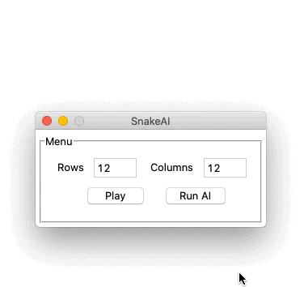

# Snake AI

Implementation of A* to play snake.

<p align="center">
    
</p>


## Installation

To install the dependencies, run the following command:

```bash
pip install -r requirements.txt
```

If using Conda, you can also create an environment with the requirements:

```bash
conda env create -f environment.yml
```

By default the environment name is `snakeAI`. To activate it run:

```bash
conda activate snakeAI
```


## Usage

Use the following command to run SnakeAI.

```bash
python -m snakeAI
```
